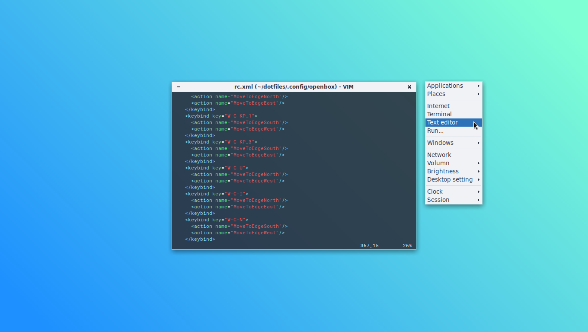
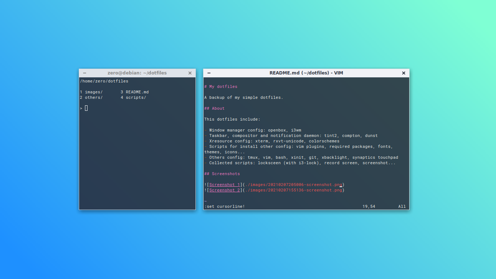

# My dotfiles

A backup of my simple dotfiles.

## About

This dotfiles include:

- Window manager config: openbox, i3wm
- Taskbar, compositor and notification daemon: tint2, compton, dunst
- Xresource config: xterm, rxvt-unicode, colorschemes
- Scripts for install other config: vim plugins, required packages, fonts, themes, icons...
- Others config: tmux, vim, bash, xinit, git, xbacklight, synaptics touchpad
- Collected scripts: locksceen (with i3-lock), record screen, screenshot...

## Screenshots

